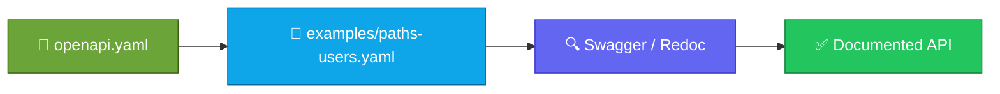

<p align="center">
  
</p>

<h1 align="center">openapi-starter</h1>

<p align="center">
  <strong>EN</strong> Minimal OpenAPI 3.x YAML example for API docs<br/>
  <strong>PT</strong> Exemplo mínimo OpenAPI 3.x YAML para docs de API
</p>

<p align="center">
  <a href="https://github.com/manansbdb/openapi-starter/blob/main/LICENSE"></a>
  
  
  <a href="#support--apoio"></a>
</p>

---

## What it does / Para que serve

| English | Português |
|---------|-----------|
| A **minimal OpenAPI 3.x** document plus a sample `paths` fragment for users. | Um documento **OpenAPI 3.x mínimo** e um fragmento `paths` de exemplo. |
| Copy `openapi.yaml` into your API repo and extend paths/components. | Copia `openapi.yaml` para a API e estende paths/components. |



---

## Install / Instalação

### 1) Clone / Clona

```bash
git clone https://github.com/manansbdb/openapi-starter.git
cd openapi-starter
```

### 2) Copy into your API / Copia para a API

```bash
mkdir -p /path/to/your-api/openapi
cp openapi.yaml /path/to/your-api/openapi/
cp examples/paths-users.yaml /path/to/your-api/openapi/
# merge path fragments into openapi.yaml as needed
```

### Requirements / Requisitos

- `git`
- Optional: Swagger UI / Redoc / spectral (all free options exist)

---

## Quick start / Início rápido

```bash
git clone https://github.com/manansbdb/openapi-starter.git
# open openapi.yaml — preview with any free OpenAPI viewer
```

---

## Contents / Conteúdos

| Path | Purpose / Função |
|------|------------------|
| `openapi.yaml` | Root OpenAPI document |
| `examples/paths-users.yaml` | Sample paths fragment |
| `SUPPORT.md` | Donations / Doações |

---

## Project layout / Estrutura

```text
openapi-starter/
├── docs/banner.svg
├── openapi.yaml
├── examples/paths-users.yaml
├── SUPPORT.md
└── README.md
```

---

## Support / Apoio

Bitcoin donations welcome / Doações em Bitcoin bem-vindas:

```
bc1q0qfnlnxyum9u45stzxe0a7jnhtj4j0usfkqdjw
```

See [SUPPORT.md](./SUPPORT.md).

---

## License / Licença

[MIT](./LICENSE) © 2026 manansbdb
