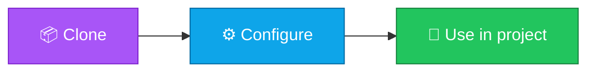

<p align="center">
  
</p>

<h1 align="center">openapi-starter</h1>

<p align="center">
  <strong>EN</strong> Minimal OpenAPI 3.x YAML example for documenting an HTTP API.<br/>
  <strong>PT</strong> Exemplo mínimo OpenAPI 3.x em YAML para documentar uma API HTTP.
</p>

<p align="center">
  <a href="https://github.com/manansbdb/openapi-starter/blob/main/LICENSE"></a>
  
  
  <a href="#support--apoio"></a>
</p>

---

## What it does / Para que serve

| English | Português |
|---------|-----------|
| Minimal OpenAPI 3.x YAML example for documenting an HTTP API. | Exemplo mínimo OpenAPI 3.x em YAML para documentar uma API HTTP. |



---

## Install / Instalação

### 1) Clone

```bash
git clone https://github.com/manansbdb/openapi-starter.git
cd openapi-starter
```

### Use / Usar

```bash
# open the files in this repo and copy what you need into your project
ls
```

### Requirements / Requisitos

- `git`
- No paid services required / Sem serviços pagos

---

## What's included / O que inclui

| File | Description |
|------|-------------|
| `openapi.yaml` | Sample OpenAPI 3.0.3 spec |
| `examples/paths-users.yaml` | Extra path fragment example |

## Usage / Uso

**EN:** Open `openapi.yaml` in Swagger Editor or Redocly. Adapt paths and schemas to your API.

**PT:** Abre `openapi.yaml` no Swagger Editor ou Redocly. Adapta paths e schemas à tua API.

---

## Support / Apoio

Bitcoin donations welcome / Doações em Bitcoin bem-vindas:

```
bc1q0qfnlnxyum9u45stzxe0a7jnhtj4j0usfkqdjw
```

**Network / Rede:** BTC (Bech32).

---

## License / Licença

[MIT](./LICENSE) © 2026 manansbdb
